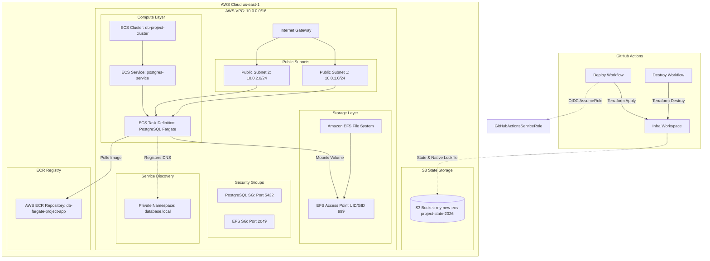

# PostgreSQL on AWS ECS Fargate: Infrastructure Documentation

Welcome to the **Database on ECS Fargate** repository. This project provisions a resilient, serverless PostgreSQL database running on **Amazon ECS (Fargate)** with persistent storage backed by **Amazon EFS**, service discovery via **AWS Cloud Discovery**, and automated infrastructure deployments via **GitHub Actions and Terraform**.

---

## 🏗️ Architecture Overview

The following Mermaid diagram outlines the infrastructure components, showing how incoming traffic, container orchestration, persistent storage, and remote state configuration interact across the AWS cloud environment.



```text
├── .github/
│   └── workflows/
│       ├── deploy.yml      # Automated Terraform apply pipeline (OIDC-enabled)
│       └── destroy.yml     # Controlled teardown workflow with explicit confirmation
├── bootstrap/
│   ├── ecr.tf              # Amazon ECR container registry configuration
│   └── main.tf             # S3 backend initialization and GitHub OIDC trust relationship
└── infra/
    ├── dns.tf              # Private Service Discovery (database.local)
    ├── ecs.tf              # ECS Cluster, Fargate Task Definition, and Service
    ├── efs.tf              # EFS File System, Mount Targets, and Access Points
    ├── iam.tf              # ECS Execution Role and policies
    ├── logging.tf          # CloudWatch Log Groups
    ├── providers.tf        # Terraform settings, S3 backend configuration, and AWS provider
    ├── security.tf         # Security groups for PostgreSQL and EFS
    └── vpc.tf              # VPC, Subnets, Internet Gateway, and Route Tables
```

## Deployment & Operations

### 1. Bootstrap Phase
Before deploying the core infrastructure, ensure your remote state storage and ECR repository are set up:

1. Navigate to the `bootstrap/` directory.
2. Run `terraform init` and `terraform apply` to provision the S3 state bucket (using native S3 state locking) and the GitHub Actions IAM Role.

### 2. Core Infrastructure Deployment
1. Push your code to the repository or manually trigger the workflow from the Actions tab in GitHub.
2. The Terraform Deploy workflow (`.github/workflows/deploy.yml`) uses GitHub OIDC authentication to securely assume an AWS IAM role without storing long-lived credentials.
3. It initializes the `infra/` workspace and executes `terraform apply -auto-approve`.

### 3. Teardown / Destruction
1. To safely remove the infrastructure, trigger the Terraform Teardown workflow (`.github/workflows/destroy.yml`).
2. You will be prompted to type `DESTROY` as a confirmation check to prevent accidental deletions.
